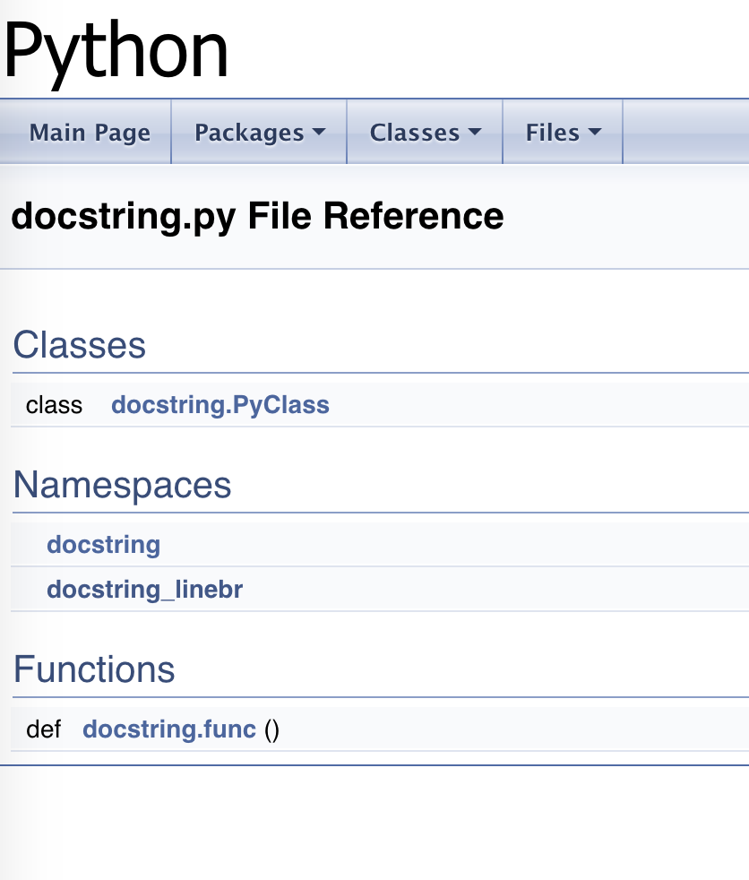
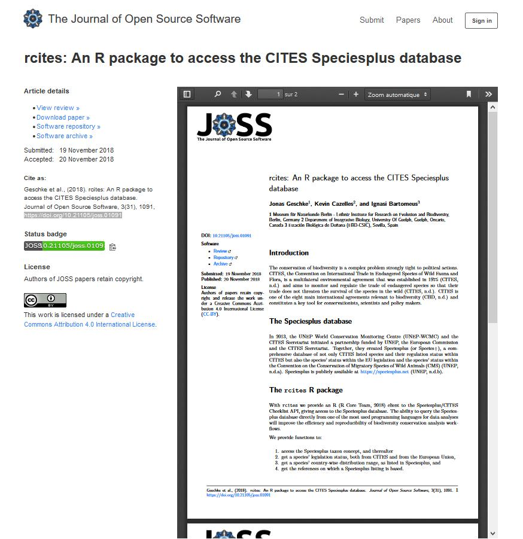

<style>
.reveal section img { background:none; border:none; box-shadow:none; }
</style>


# Part 3 : Documentation

<aside class="notes"> 45 min</aside>

---

## Documentation supports open source and versioning

<aside class="notes"> Documentation supports the previous points i.e. open source and versioning 
all along the code/software lifecycle
from both producer and consumer point of views.
Let's reviews the benefits of documenting one's work
</aside>
----

Keep track with one's own work
<p class="fragment">Understand others' work</p>

----

Internal communication 
<p class="fragment">External communication</p>
----

Identify source code/software
<p class="fragment">Identify code/software producers
(myself or fellow coders)</p>

<aside class="notes"> What? Why? Who? When? Where? How? </aside>

----

Share/Reuse code
<p class="fragment">Contribute/Get contributions</p>

----

Cite/Be cited
<p class="fragment">Credit/Be credited</p>

---

## Warning

----

Sharing and reusing IS NOT an invitation to plagiarism.

<p class="fragment">You still have to cite, and use the code according to the license </p>

<aside class="notes"> Provided that sharing and reusing IS NOT an invitation to plagiarism. 
We act responsibly. 
See Licenses part for ways to counteract plagiarism
</aside>
---

## Documentation also supports

----

Software indexing/retrieval in :

- software platforms

- repositories 

- libraries

<aside class="notes"> Use case example --> when searching for code
</aside>
----

Software long term preservation/archiving

<aside class="notes"> Use case example --> when managing legacy code
You don't want to throw it away
Code as a memory artefact
</aside>
---

## What you want to document
## What you will mention

----

* Description of the source code

* Description of the software 

----

Including 
* Code explanations

* Usage

* Author

* Contact infos

* UPIds (Unique Persistent IDentifiers)

* License

* ...

<aside class="notes"> UPIds such as URI (unique resource identifier)
DOI (digital object identifier)
ORCID (digital name identifier)
</aside>
---

## Box: Popular Open Source Licenses

----

Choose a licence and stick to it. 

It can be very painful to change a licence (need to ask all the contributors).

Here is the list of Open Source Licences as suggested by the TTO
https://tto.epfl.ch/scientists/software/choose_the_license/open_source_licenses/

----

### MIT

* Short

* Permissive

* No warranty

* http://opensource.org/licenses/MIT

<aside class="notes"> The MIT license is a very short and permissive license for users. The software can be used for any application including integration into commercial software (e.g. proprietary software) as long as the original copyright holder is cited in the re-distributed software. Software is provided without warranty and the software author/owner cannot be held liable for damages (as far as permitted by applicable law).
</aside>
----

### BSD

* Short

* Permissive

* Trademarks prohibited

* No warranty

* http://opensource.org/licenses/BSD-3-Clause

* http://opensource.org/licenses/BSD-2-Clause

<aside class="notes"> The BSD license is also a very short and permissive license for users. The software can be used for any application including integration into commercial software (e.g. proprietary software) as long as the original copyright holder is cited in the re-distributed software. Use of trademarks from original licensors is expressly prohibited. Software is provided without warranty and the software author/owner cannot be held liable for damages (as far as permitted by applicable law).
</aside>
----

### Apache 2.0

* Permissive

* Patents allowed

* No warranty

* http://opensource.org/licenses/Apache-2.0

<aside class="notes"> Apache is also considered a permissive license for users. The software can be used for any application including integration into commercial software (e.g. proprietary software) as long as the original copyright holder is cited in the re-distributed software. The license provides an express grant of a license under patents, which the contributors may have on the software. Software is provided without warranty and the software author/owner cannot be held liable for damages (as far as permitted by applicable law).
</aside>
----

### GPL

* Copyleft license

* Patents allowed

* Viral

* http://opensource.org/licenses/gpl-3.0

<aside class="notes"> Define COPYLEFT: GPL is a so-called “copyleft “ license. This means that anyone who wants to re-distribute the code in a modified or unmodified form shall also  share the source code of the original software as well as the source code of his/her own modifications, under the same license terms. For this reason GPL license is also called viral. 
The license provides an express grant of a license under patents, which the contributors may have on the software.
Commercial use of GPL code is allowed as long as the source code is also provided to end users.
</aside>
----

### LGPL

* Sharing libraries under the same terms

* Mix of different licenses allowed

* http://opensource.org/licenses/LGPL-3.0

<aside class="notes"> Based on the original GPL license the Lesser GPL software license is applied to software libraries and requires sharing, under the same terms, the source code of any modified or unmodified version of the library, which the user wants to further distribute. Integration and distribution of proprietary software with different license terms in conjunction with LGPL software is in principle allowed provided that the library is just linked to the main application.
</aside>
----

### AGPL

* Strong copyleft

* Patents allowed

* Viral

* http://opensource.org/licenses/AGPL-3.0

<aside class="notes"> Affero GPL is a very strong copyleft license that requires anyone distributing or using server applications using AGPL protected software to made available the source code to any network user. This license is also considered viral (see above “GPL”). The license provides an express grant of a license under patents, which the contributors may have on the software. Commercial use of AGPL code is allowed as long as the source code is also provided to end users.
</aside>
---

## Challenges

Dependencies documentation management

<aside class="notes"> What about documentation structures and mechanisms when applied to code dependencies? 
At first it sounds complex, and it's even more complex than it sounds. 
Just as licenses can be viral (as seen previously)
how viral can be code documentation and code attributes?
Not well handled at the time being and being current research subject. 
</aside>
---

## Various ways to code documentation

* embedded documentation

* supported documentation with a README file

* supported documentation with metadata

* documentation AND publication with a software paper

<aside class="notes"> We will talk about 4 ways to document your code
from the closest place to your lines of code to the most peripheral documentation
</aside>

----

### Embedded documentation

* comments & annotations

* documentation generation


----

### A python Example

```python
  """@package docstring
  Documentation for this module.
  More details.
  """
  
  def func():
      """Documentation for a function.
      More details.
      """
      pass
  
  class PyClass:
      """Documentation for a class.
      More details.
      """
      def __init__(self):
          """The constructor."""
          self._memVar = 0;
  
      def PyMethod(self):
          """Documentation for a method."""
          pass
```
  
----
  
### Doxygen Documentation
  
   
  
  [ReadtheDocs](https://readthedocs.org/)
  
----
  
### Supported documentation with a README file
  
  README file shall include
  

```
  $project
  ========
  
  $project will solve your problem of where to start with documentation,
  by providing a basic explanation of how to do it easily.
  
  Look how easy it is to use:
  
      import project
      # Get your stuff done
      project.do_stuff()
  
  Features
  --------
  
  - Be awesome
  - Make things faster
  
  Installation
  --------
  
  Install $project by running:
  
      install project
  
  Contribute
  --------
  - Issue Tracker: github.com/$project/$project/issues
  - Source Code: github.com/$project/$project
  
  Support
  --------
  
  If you are having issues, please let us know.
  We have a mailing list located at: project@google-groups.com
  
  License
  --------
  
  The project is licensed under the BSD license.
```
  

----

### Supported documentation with metadata

----

DOAP (Description Of A Project) 
description files

<aside class="notes"> DOAP stands for description of a project
it's an rdf/xml schema and vocabulary
just mentioning
slightly deprecated
</aside>
----

CITATION files

(2 examples: CFF and codemeta)

----

EXAMPLE 1 : Citation File Format (CFF) file (yaml)

``` yaml
cff-version: 1.0.3
message: If you use this software, please cite it as below.
authors:
  - family-names: Masson
    given-names: Antoine
    orcid: https://orcid.org/0000-0002-7993-5698
    affiliation: Ecole Polytechnique Fédérale de Lausanne, Library
    email: antoine.masson@epfl.ch
title: Cost Calculator
version: beta 2.1
doi: 10.5281/zenodo.1469034
date-released: 2018-10-08
repository-code: https://c4science.ch/source/costcalc/repository/master/
url: https://rdmepfl.github.io/costcalc/
keywords: 
    - research data
    - storage
    - cost estimate
    - planning
abstract: A dynamic online tool for calculating the cost of research data storage services. It's highly modular and can be adapted for all kind of application. The system is really easy to install as it uses only opensource javascript libraries.
license: GPL-3.0-only
``` 

<aside class="notes"> CFF stands for Citation File Format (2017). 
The aim of this xsd schema (13 core elements) is proper and machine actionable code/software citation
</aside>
----

EXAMPLE 2 : codemeta file (json-ld)

``` json
{
    "@context": "https://doi.org/10.5063/SCHEMA/CODEMETA-1.0",
    "@type": "Code",
    "author": [
        {
            "@type": "Person",
			"name": "Antoine Masson",
			"@id": "https://orcid.org/0000-0002-7993-5698",
			"affiliation": "Ecole Polytechnique Fédérale de Lausanne, Library",
            "email": "antoine.masson@epfl.ch"
        }
    ],
	"name": "Cost Calculator",
	"softwareVersion": "beta 2.1",
	"identifier": "10.5281/zenodo.1469034",
    "datePublished": "2018-10-08",
    "codeRepository": "https://c4science.ch/source/costcalc/repository/master/",
	"URL": "https://rdmepfl.github.io/costcalc/",
	"programmingLanguage": "javascript",
    "keywords": "research data, storage, cost estimate, planning",
    "description": "A dynamic online tool for calculating the cost of research data storage services. It's highly modular and can be adapted for all kind of application. The system is really easy to install as it uses only opensource javascript libraries.",
    "license": "GPL-3.0-only"
}
``` 

<aside class="notes"> The Codemeta Project has been active for several years (latest version 2017). 
The second version of this json-ld schema has a set of 74 elements 
to precisely and accurately describe all kinds of features for code/software 
(and serve any purpose related to code and software). 
</aside>
----

### Repository metadata

----

EXAMPLE 3 : Zenodo repository with doi attribution

http://doi.org/10.5281/zenodo.1469603


<aside class="notes"> here's what our costcalculator code looks like once in Zenodo
we notice the metadata, DOI in particular
we notice the cff and codemeta files among all the files 
</aside>
----

## Software paper

documentation AND publication

<aside class="notes"> software papers add another layer of documentation AND publication
Such papers highlight the software itself
The research question it is based upon is not the point
The algorithm novelty is not the point either
</aside>
----

EXAMPLE 1 : Journal of Open Source Software (JOSS)

https://doi.org/10.21105/joss.01091



----

EXAMPLE 2 : Journal of Cheminformatics

https://doi.org/10.1186/s13321-018-0297-4


---

## A few facts and figures

----

A quick scoping search in GitHub showed:
<p class="fragment">several thousand mentions of DOAP files,</p>
<p class="fragment">a few hundred mentions of codemeta files,</p>
<p class="fragment">a few dozens of cff files...</p>
----

[58300 DOIs for software (May 2018)](https://blog.datacite.org/doi-registrations-software/)
to compare with 

<p class="fragment">[175 million DOI names in the world (July 2018)](https://www.doi.org/factsheets/DOIKeyFacts.html)</p>

<aside class="notes"> What's more, most recent data show that
</aside>
----

[Dozens of journals](https://www.software.ac.uk/resources/guides/which-journals-should-i-publish-my-software) dedicated to scientific software

<aside class="notes"> for those interested in software journals, as of today, there are dozens of journals (see for instance Software Sustainability Institute website)
</aside>
---

## Focus on metrics

----

Software and source code developers as full scientific contributors

<p class="fragment"> Metrics for acknowledgment</p>

----

Metrics for data lead to metrics for code

<p class="fragment">Metrics for evaluation purpose</p>

<aside class="notes"> Current position is that data without code or software would be half-useful data only. 
Code considered as central research output and as such
</aside>
----

Is [code/software "just data"](https://peerj.com/preprints/2630/)?

For [citation](https://genr.eu/wp/genr-software-citation-round-up/?pk_campaign=feed&pk_kwd=genr-software-citation-round-up) purpose, code/software is clearly not "just data".

<aside class="notes"> Work in the academic world currently assuming that code should be handled as a type of research output *per se*. 
</aside>
----

The topic of metrics for code is still new,
gaining attention,
fostering efforts such as [FORCE11 working group](https://www.force11.org/software-citation-principles).

<aside class="notes"> The topic of metrics for code is still new (< 5 years)
</aside>
----

Metrics for code: 

traditional scientometrics 

newer altmetrics

<aside class="notes"> mix between current widely adopted "traditional" scientific metrics related to the publication process 
and altmetrics (for instance Plumx metrics for Plumx platform handle code as a measurable research artifact [PlumX](https://plumanalytics.com/learn/about-artifacts/))
</aside>
----

Defining metrics for code is 
<p class="fragment">a work in progress</p>
<p class="fragment">... and controversial </p>

<aside class="notes"> in short, as every work on metrics (for instance [Open Science Monitor indexes](https://ec.europa.eu/info/files/open-science-monitor-methodological-note_en)).
Heated debate
</aside>
---

## Food for thought

----

### Remember

* comments, annotations, doc generation
* README
* DOAP
* metadata (CFF, codemeta)
* software papers

Can you relate? 

----

### Stay tuned

* Code plagiarism
* Licenses
* Dependencies documentation management
* Metrics for code

Can you relate? 

---

## Further readings

----

Examples of source code (metadata) repositories 

* [https://libraries.io/](https://libraries.io/)
* [http://ascl.net/](http://ascl.net/)

----

Software-specific metadata schemas

* [CodeMeta](https://codemeta.github.io/)
* [Citation File Format (CFF)](https://citation-file-format.github.io/)
* [DOAP](https://github.com/ewilderj/doap)

----

Software preservation initiatives

* [http://www.softwarepreservationnetwork.org/](http://www.softwarepreservationnetwork.org/)
* [https://www.softwareheritage.org/](https://www.softwareheritage.org/)

----

Open Source Licenses

* [https://tto.epfl.ch/scientists/software/choose_the_license/open_source_licenses/](https://tto.epfl.ch/scientists/software/choose_the_license/open_source_licenses/)

----

Recommended readings

* [https://www.software.ac.uk/](https://www.software.ac.uk/)
* [https://genr.eu/wp/](https://genr.eu/wp/)
* [Top 10 metrics for life science software good practices](https://www.ncbi.nlm.nih.gov/pmc/articles/PMC5007752/)
* [Good enough practices in scientific computing](https://journals.plos.org/ploscompbiol/article?id=10.1371/journal.pcbi.1005510)
* [Handbook of Open Source Tools](https://link.springer.com/book/10.1007%2F978-1-4419-7719-9)
* [How open science helps researchers succeed](https://europepmc.org/articles/pmc4973366)


