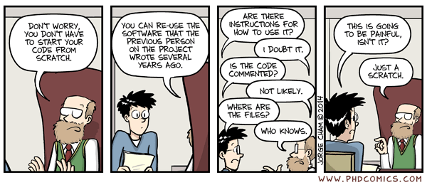
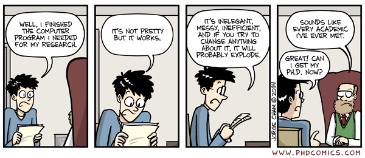
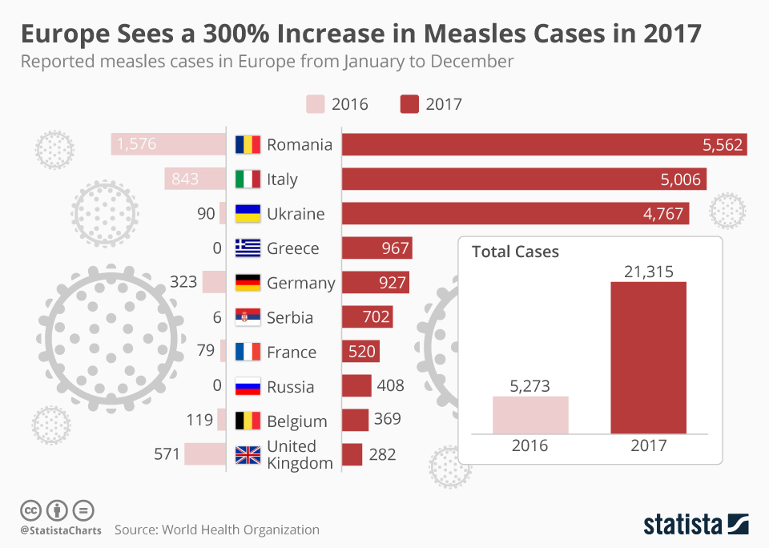
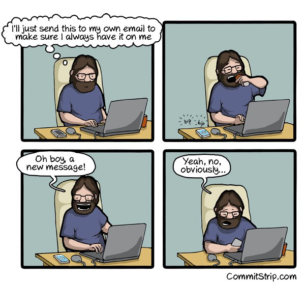
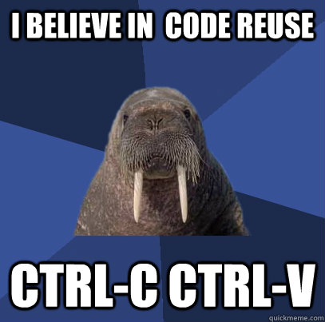
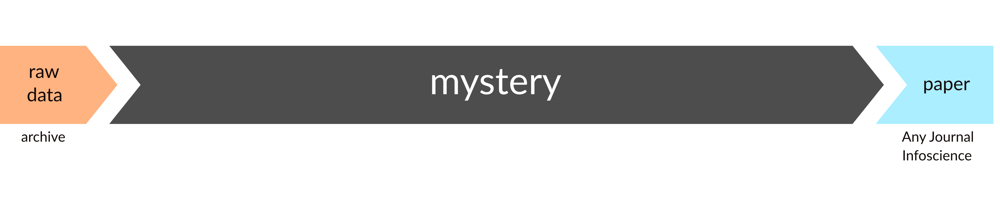
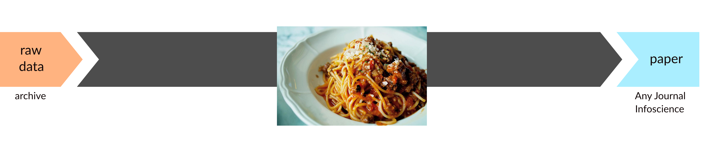
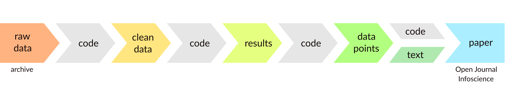

<style>
.reveal section img { background:none; border:none; box-shadow:none; }
</style>

# who are you?

# who are we?

# SCITAS 

# the Library

# why us?

# so, you want to go open science?

# Welcome!

---




# Thomas


---

<pre><code>thomas@macbook:~♥ gfortran fe-code.f90
thomas@macbook:~♥ ./a.out 
  -511217312.    
thomas@macbook:~♥ ./a.out 
   320487776.    
  


</code></pre>

---

# Oops


# What Thomas did not do

---

<pre><code>thomas@macbook:~♥ gfortran -fbounds-check  fe-code.f90 
thomas@macbook:~♥ ./a.out 
At line 9 of file fe-code.f90
Fortran runtime error: Index '0' of dimension 1 of array 'a' below
lower bound of 1

Error termination. Backtrace:
#0  0x7fb554834d4a
#1  0x7fb554835825
#2  0x7fb554835bca
#3  0x561f9eb609cb
#4  0x561f9eb60ac4
#5  0x7fb553d402e0
#6  0x561f9eb607f9
#7  0xffffffffffffffff

</code></pre>

--- 

## Quiz

What is wrong with the code?

- no versioning
- it's not GPL
- insufficient debugging
- insufficient testing

---

## Quiz

What can go wrong with the science?


---

## Quiz

What can we suggest to Thomas?

---

---

Consider the paper like an advertisement for your work.
Scholarship is in code and data.

---

# Goal number 1

```{r mean, echo=FALSE, warning=FALSE, fig.height=6,fig.width=8}
data1 <- read.csv("mean_median.csv")
library(ggplot2)
library(reshape2)

m=apply(data1,2,FUN=median)
median_=data.frame(variable=names(m), value=m, row.names = NULL)

m=apply(data1,2,FUN=mean)
mean_=data.frame(variable=names(m), value=m, row.names = NULL)

data <- melt(data1,measure.vars=c(1,2,3,4))
p<-ggplot(data,aes(x=variable, y=value))+geom_point(alpha=0.05, color='blue') + geom_point(data=mean_, color='white', size=4) + geom_point(data=mean_, color='black', size=3) + xlab('') + ylab('age') + theme_grey(base_size = 24)
p

```
---

# Goal number 1

```{r median, echo=FALSE, warning=FALSE, fig.height=6,fig.width=8}
p<-ggplot(data,aes(x=variable, y=value))+geom_point(alpha=0.05, color='blue') + geom_point(data=mean_, color='white', size=4) + geom_point(data=mean_, color='black', size=3) + geom_point(data=median_, color='white', size=4) + geom_point(data=median_, color='red', size=3) + xlab('') + ylab('age') + theme_grey(base_size = 24)
p

```

# Goal number 2

## build on the shoulder of giants


# Goal number 3

## be the giant


---



---


# Don'ts


---

```{c, uglycode, eval='false'}

if(!q){
v=0;
e(a,c){
v+=l?o[-f+a]:0;
v+=z?o[a*f-1]:0;
}

   
*i+=z&&l?v/2:v;
}
R(i+d,1,i,1,c,c,10);
R(o,f,i+d,c,1,c,10+g);
```

---


```{c, uglycode-indent, eval='false'}

if(!q){
   v=0;
   e(a,c){
      v+=l?o[-f+a]:0;
      v+=z?o[a*f-1]:0;
   }

   
   *i+=z&&l?v/2:v;
}
R(i+d,1,i,1,c,c,10);
R(o,f,i+d,c,1,c,10+g);
```

---

```{c, uglycode-indent-comment, eval='false'}
/* Messy code follows */
if(!q){
   v=0;
   e(a,c){
      v+=l?o[-f+a]:0;
      v+=z?o[a*f-1]:0;
   }

   
   *i+=z&&l?v/2:v;
}
R(i+d,1,i,1,c,c,10);
R(o,f,i+d,c,1,c,10+g);
```

---

```{c, uglycode-indent-comment2, eval='false'}
/* Messy code follows */
if(!q){
   v=0;
   e(a,c){
      v+=l?o[-f+a]:0;
      v+=z?o[a*f-1]:0;
   }
/* VR: trust me, I know what I am doing */
   
   *i+=z&&l?v/2:v;
}
R(i+d,1,i,1,c,c,10);
R(o,f,i+d,c,1,c,10+g);
```

---

```{c, uglycode-indent-comment3, eval='false'}
/* Messy code follows */
if(!q){
   v=0;
   e(a,c){
      v+=l?o[-f+a]:0;
      v+=z?o[a*f-1]:0;
   }
/* VR: trust me, I know what I am doing */
/* WS -- Don't trust me I have no idea what she was doing */   
   *i+=z&&l?v/2:v;
}
R(i+d,1,i,1,c,c,10);
R(o,f,i+d,c,1,c,10+g);
```

---

# Messy code

---

# Useless comments

---

```{fortran, wrongcode, eval='false'}
integer :: i, a(10), b, c
 
do i=1,size(a)
   a(i) = 1
end do

d=0
do i=0,size(a)+1
   d = d+a(i)
end do
```

---

# Errors

---

<pre><code>thomas@macbook:~♥ rm -rf ~/
</code></pre>

---

# code/software loss

---


---



---

# irreversible mistakes

---



---


# isolated code/software

---


---

#  ignored contribution as a developer

---



---

# code reinvention or duplication of experimental runs over and over

---


# Let's be positive

---

# And do things well

---

# File management

<div class="fragment" data-fragment-index="1">
### efficient
</div>
<div class="fragment" data-fragment-index="2">
### time saving
</div>

---

# Documentation

<div class="fragment" data-fragment-index="1">
### reusable
</div>
<div class="fragment" data-fragment-index="2">
### by yourself, your colleagues, the world
</div>

# Versioning

<div class="fragment" data-fragment-index="1">
### safe
</div>
<div class="fragment" data-fragment-index="2">
### reliable
</div>
<div class="fragment" data-fragment-index="3">
### citable
</div>

# Reappropriation

# Collaboration

# Acknowledgement

# Build your code portfolio

---

---

# Open Science

---

## umbrella term

---

## movement

---

## sharing results and methodologies<br>at all stages

---

# open access to publications

# open research data

# open source software

# open collaboration

# open peer review

---

# Why?

---

# Because we're nice people

---

# Public money, public data

---

# Requirement<br>from the funding agencies

---


---

# Open Science is good for you

---

# Visibility
<div class="fragment" data-fragment-index="1">
## larger impact
</div>


# Scrutiny
<div class="fragment" data-fragment-index="1">
## better quality
</div>


# Reuse
<div class="fragment" data-fragment-index="1">
## higher efficacy
</div>


# Public access
<div class="fragment" data-fragment-index="1">
## fair opportunity
</div>


---

# Science is supposed to be Open!

---

# Open Source

<div class="fragment" data-fragment-index="1">
something you can modify and share
</div>
<div class="fragment" data-fragment-index="2">
publicly accessible design
</div>
<div class="fragment" data-fragment-index="3">
software with source code that anyone can
</div>
<span class="fragment" data-fragment-index="4">inspect</span><span class="fragment" data-fragment-index="5">, modify</span><span class="fragment" data-fragment-index="6">, and enhance</span>

# Free software

# Logiciel libre

# Free as in freedom

# The four essential freedoms

---

## Freedom #0

<div class="fragment" data-fragment-index="1">
run the program as you wish, for any purpose<br><br>

</div>

---

## Freedom #1

<div class="fragment" data-fragment-index="1">
study how the program works,<br>and change it so it does your computing as you wish
</div>

---

## Comments to Freedom #1

<div class="fragment" data-fragment-index="1">
Need access to the source code
</div>
---

## Freedom #2

<div class="fragment" data-fragment-index="1">
redistribute copies so you can help others
</div>
---

## Freedom #3

<div class="fragment" data-fragment-index="1">
distribute copies of your modified versions to others
</div>
---

## Comments to Freedom #3
<div class="fragment" data-fragment-index="1">
the whole community can benefit from your changes
</div>
<div class="fragment" data-fragment-index="2">
need access to the source code
</div>
---

# Open Source? Free?

values

---


---

# Free and Open Source licenses

# Not including a license?

<div class="fragment" data-fragment-index="1">
doesn't mean your code is open
</div>


# A license must be provided

<div class="fragment" data-fragment-index="1">
to define what is allowed to do with your work
</div>

<div class="fragment" data-fragment-index="2">
### citation
</div>

<div class="fragment" data-fragment-index="3">
### usage
</div>

<div class="fragment" data-fragment-index="4">
### sharing
</div>


# A license must be provided


to protect your work


### &nbsp;
### &nbsp;
### &nbsp;


# Using external libraries

## check their licenses

# More on this later

---

# Open Format

goal: reuse the software and the generated data


# Dos

- use open file standard
- custom format? give the format used!

# Dos

- use open language, libraries
- other can install and use and contribute to your code

---

# Caveats

- some proprietary software do not allow distribution of the output files
- read the license agreement, or take advantage of the work done by VPSI


### https://support.epfl.ch/epfl?id=epfl_eula_conditions

---

# Confidentiality and publishing

can we publish everything?

---

# Confidentiality and publishing

- agreement of all the authors
- anonymize attached data (passwords!)
- licenses changes are HARD! talk to the EPFL TTO
- publish data and code once paper is out


---

# Summary

---

# Things are changing

---

# Before

##  unfair dissemination<br>knowledge as object of trade<br><br>

# Before

## irreproducibility<br>sloppy science<br>bad press

# Before

## paper is out<br>science already old<br><br>

# Before

## scholarship beyond publication<br>is considered irrelevant<br><br>

# Before



# Before




# After

## entire research process<br>transparent and accessible<br><br>

# After

##  increase cooperation and efficiency<br>therefore impact<br><br>

# After

## change in the way<br>scholarly knowledge<br>is produced, evaluated and disseminated

# After

## ownership<br>back to<br>the scientific community

# After

## knowledge transfer from academia to society<br>is facilitated<br>more trust!


# After



# Go open!

---

# What's next

---

## Versioning and collaborative work

## Documentation and dissemination

## Afternoon workshop: practice with c4science and GitHub

